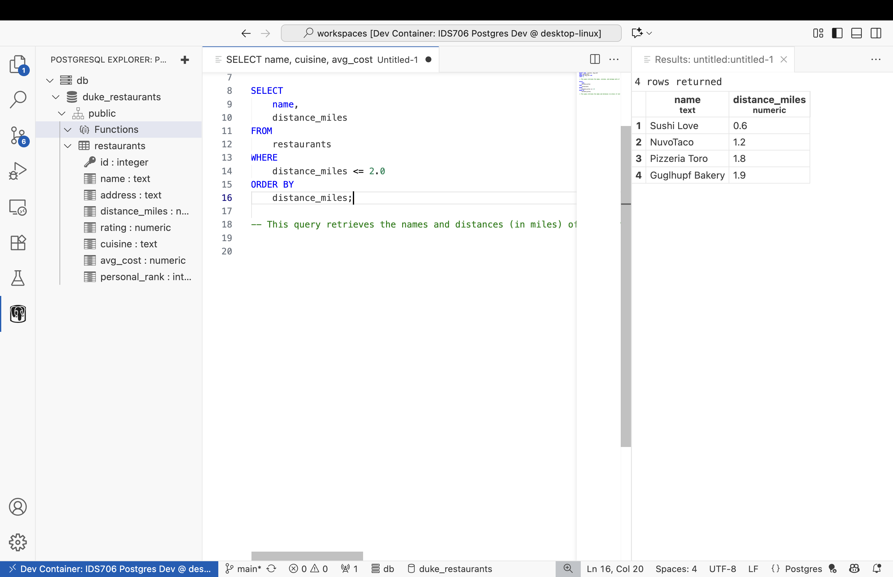
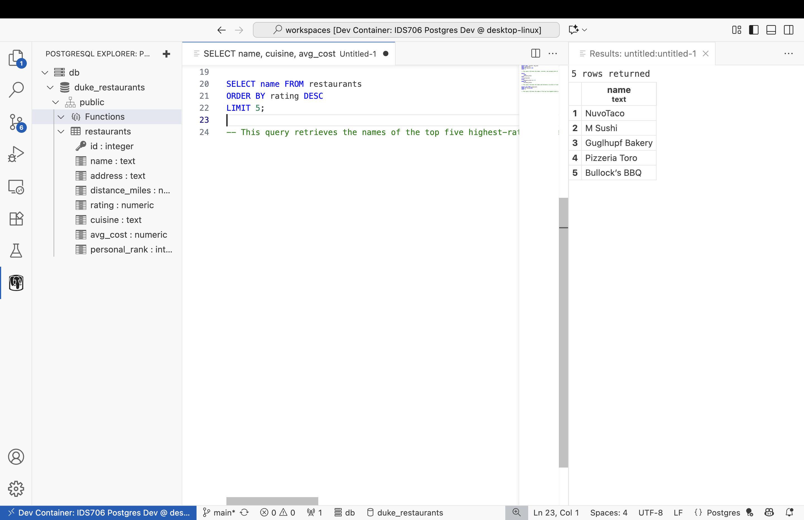
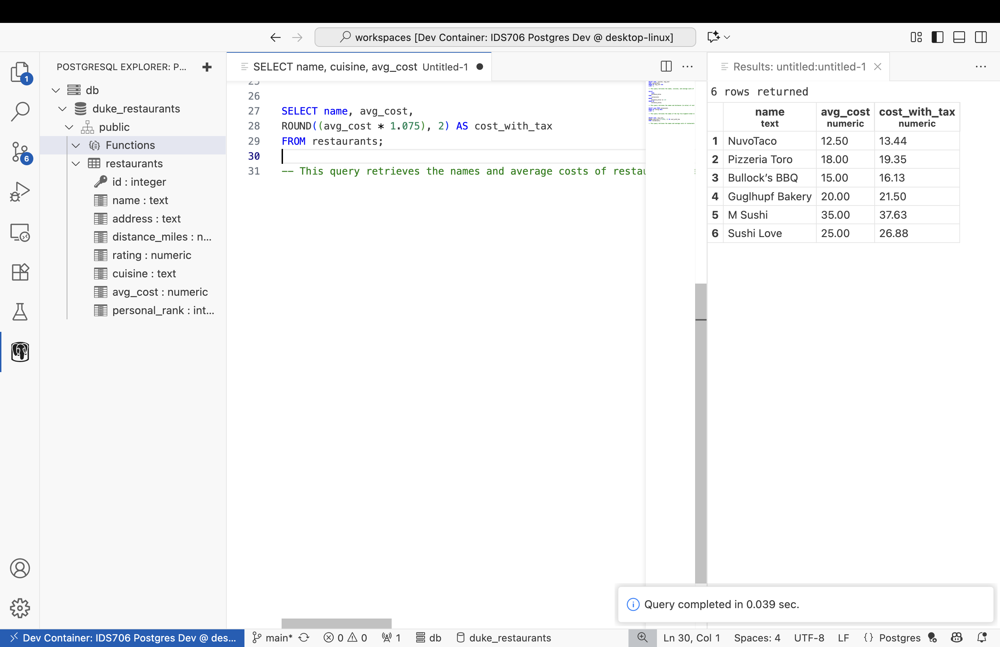
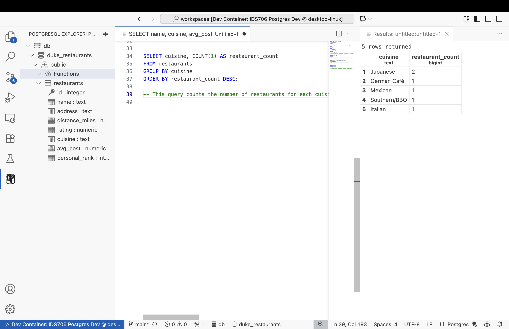

# ids706-postgres-demo
1. Return `name, distance_miles` for restaurants **within 2.0 miles**, ordered by distance.
   
2. Show the **top 3** restaurants by rating (highest first).
   
3. List `name, avg_cost` and **cost with 7.5% tax** as `cost_with_tax`.
   
4. How many restaurants are there **per cuisine**, highest count first?
   
